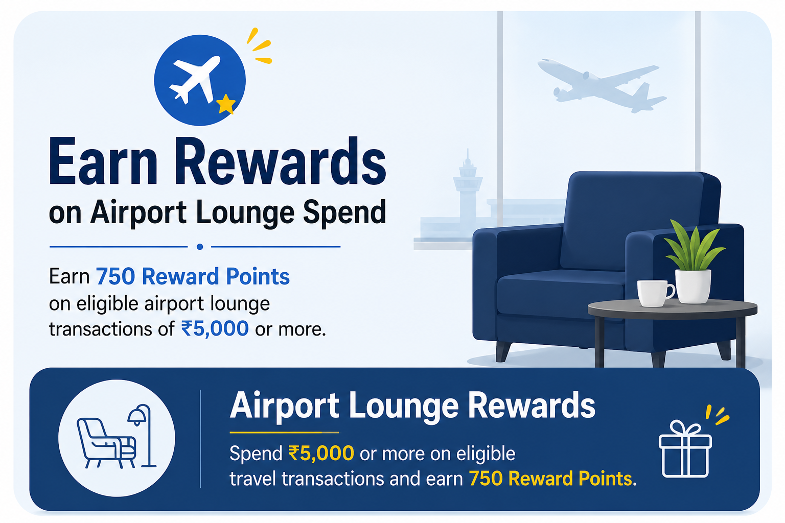

## Overview

This guide explains how to configure the **Airport Lounge Reward Points** offer in the Offer Management System (OMS).

## Business objective

The **Airport Lounge Reward Points** offer is designed to encourage customers to use their eligible credit cards for airport lounge and travel-related transactions by rewarding qualifying transactions with **750 Reward Points**.

### Offer type

| Field | Value |
|-------|-------|
| Offer Type | Transactional Offer |
| Offer Outcome | Reward Points |

This offer rewards customers with **750 Reward Points** on eligible **Flight MCC** transactions.

---

# Basic details

Navigate to **Offer Creation → Basic Details** and configure the following fields.

## Configuration

| Field | Value | Description |
|-------|-------|-------------|
| Offer Name | Airport Lounge Reward Points | Name displayed for the offer. |
| Offer Description | Earn 750 Reward Points on eligible airport lounge transactions. | Short description displayed for the offer. |
| Offer Duration | 06 Jul 2026 – 22 Oct 2026 | Period during which the offer remains active. |
| Eligibility Level | Account Level | Eligibility is evaluated independently for each eligible account. |
| Issuer | Demo-Bank | Credit card issuing bank. |
| Program Type | Credit Card | Product type for which the offer is applicable. |
| Program | IOB DEMO | Eligible credit card program. |

> **Selected Configuration:** The offer is configured at the **Account Level**, allowing eligibility to be evaluated independently for each eligible account.

---

# Set up offer user base

After configuring the basic details, define the customer group that will be eligible for the offer.

## User Base

| Field | Value | Description |
|-------|-------|-------------|
| User Base | Static Base | Eligible customer list is fixed when the offer goes live. |

> **Selected Configuration:** Static Base ensures that only customers included before the offer goes live are eligible.

---

# Set up transaction eligibility

Configure the transaction conditions that determine whether a transaction qualifies for reward points.

## Configuration

| Field | Value | Description |
|-------|-------|-------------|
| Transaction Eligibility | Default | Uses the default transaction eligibility configuration. |
| MCC | Flight MCC | Only eligible airport lounge and travel-related transactions qualify for the offer. |

---

## Date for offer processing

| Field | Value | Description |
|-------|-------|-------------|
| Offer Processing Date | Transaction Date | Reward eligibility is evaluated using the transaction date. |

> **Selected Configuration:** Rewards are calculated based on the transaction date.

---

# Calculate the offer outcome

After configuring transaction eligibility, define how reward points are calculated.

## Offer calculation rule

| Field | Value | Description |
|-------|-------|-------------|
| Offer Calculation Rule | Flat | A fixed number of reward points is credited for every eligible transaction. |
| Reward Points | 750 | Customers receive 750 Reward Points for each eligible transaction. |

> **Selected Configuration:** Customers earn **750 Reward Points** on every eligible Flight MCC transaction.

---

# Usage limit

The **Usage Limit** defines the maximum reward points a customer can receive during the configured validity period.

| Field | Value | Description |
|-------|-------|-------------|
| Limit Duration | Month | Reward limit resets every calendar month. |
| Limit Type | Reward Points | Rewards are limited by points. |
| Limit Value | 750 Reward Points | Maximum reward points allowed every month. |

> **Selected Configuration:** Customers can earn up to **750 Reward Points per calendar month**.

---

# Define when to post your offer

Configure how and when reward points are credited.

## Posting eligibility

| Field | Value | Description |
|-------|-------|-------------|
| Enable Posting | Enabled | Allows reward points to be credited. |
| Posting Eligibility | Account Status | Rewards are posted only to eligible accounts. |
| Account Status | ACTIVE | Only active accounts receive reward points. |
| Offer Posting | Immediately | Reward points are credited immediately after an eligible transaction. |

---

## Reward points expiry

| Field | Value | Description |
|-------|-------|-------------|
| Reward Points Expiry | 365 Days | Reward points expire 365 days after they are credited. |

---

## Narration

| Field | Value | Description |
|-------|-------|-------------|
| Posting Narration | Airport Lounge Reward Points Credited | Displayed when reward points are successfully credited. |
| Reversal Narration | Airport Lounge Reward Points Reversed | Displayed if reward points are reversed. |

---

# Craft the perfect UI: Home page

Configure how the offer appears in the Progressive Web App (PWA).

## Display configuration

| Field | Value | Description |
|-------|-------|-------------|
| Labels | Travel | Categorizes the offer. |
| Banner Title | Earn 750 Reward Points on Airport Lounge Transactions | Main banner title. |
| Banner Description | Enjoy airport lounge access and earn 750 Reward Points on eligible travel transactions. | Banner description displayed to customers. |
| Display Title | Airport Lounge Reward Points | Offer card title. |
| Display Description | Use your eligible credit card for airport lounge transactions and earn 750 Reward Points. | Offer card description. |
| Display Order | 3 | Determines display priority. |
| Display Color | #1E40AF | Primary color used for the offer card. |

---

# Craft the perfect UI: Details page

The **Details Page** provides customers with complete information about the offer.

## Section details

### How it works

1. Visit an eligible airport lounge.
2. Use your eligible credit card to make the transaction.
3. The transaction is validated against the configured **Flight MCC**.
4. Earn **750 Reward Points** after successful transaction processing.

### Terms and conditions

- Valid only on eligible Flight MCC transactions.
- Earn **750 Reward Points** on eligible transactions.
- Reward points expire 365 days after posting.
- Cancelled or refunded transactions are not eligible.
- Standard terms and conditions apply.

### CTA button

| Field | Value | Description |
|-------|-------|-------------|
| Text on Button | Explore Travel Benefits | CTA button displayed on the offer details page. |

> **Selected Configuration:** The details page clearly explains the reward eligibility, posting rules, reward expiry, and customer benefits.

---

# Summary

This guide demonstrates the complete configuration of the **Airport Lounge Reward Points** transactional offer, including customer eligibility, transaction qualification, reward calculation, usage limits, posting configuration, and customer-facing UI setup in the Progressive Web App (PWA).
