---

title: Transactional Offers
description: User Manual for Transactional Offers
---
-------------------------------------------------

## Introduction

This guide explains how to create and configure Transactional Offers in the Hyperface Dashboard.

Transactional Offers enable issuers to reward customers for performing qualifying individual transactions. Eligibility is configured using transaction-level conditions such as MCC, MID, Transaction Amount, POS Entry Mode, and other transaction attributes.

This document covers the complete offer creation journey, offer listing management, and key field-level guidance.

---

## What are Transactional Offers?

Transactional Offers are reward campaigns triggered when a customer completes a single qualifying transaction.

Unlike Milestone Offers, no spend accumulation is required. Reward eligibility is evaluated individually for each transaction.

### Components

A Transactional Offer consists of:

* Offer Details
* User Base Configuration
* Transaction Eligibility Rules
* Offer Calculation Rules
* Usage Limits
* Posting Configuration
* Display Elements

---

## Create a Transactional Offer

Follow the steps below to create a new Transactional Offer.

1. Navigate to the Offer Listing page.
2. Select the appropriate Offer Category tab.
3. Click **Create New Offer**.
4. Select **Transactional Offer**.
5. Choose the Outcome Type.
6. Continue through the configuration journey.

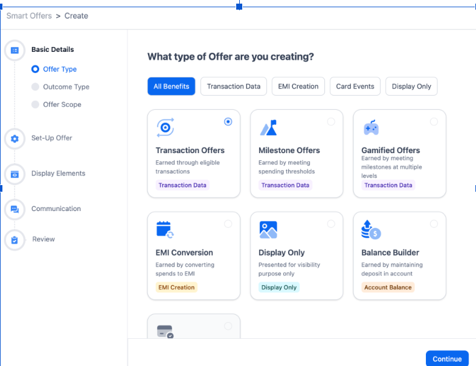

### Outcome Type Selection

Select the reward outcome that customers will receive after completing a qualifying transaction.

* Cashback
* Reward Points
* Voucher
* Smart Tag

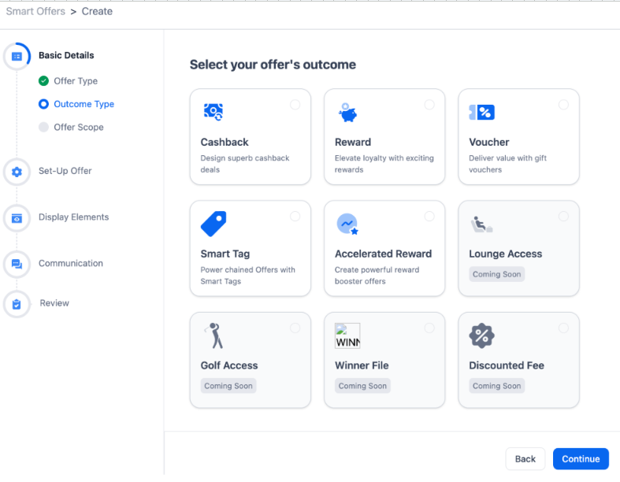

---

## Step 1: Configure Offer Details

This section captures the basic identity and scope of the offer.

Configure:

* Offer Name
* Offer Description
* Start Date & Time
* End Date & Time
* Eligibility Level
* Issuer
* Program Selection

### Program Configuration

* Apply to all current and future programs
* Select specific programs
* Verify configuration before saving

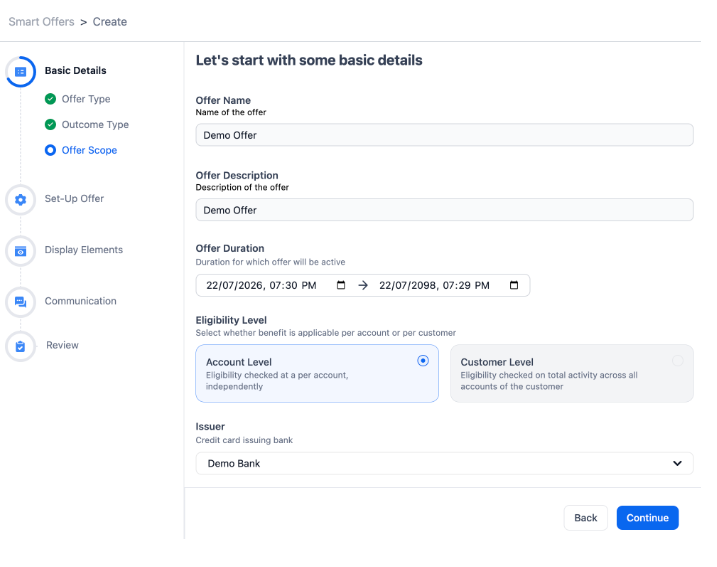

---

## Step 2: Configure Offer User Base

Define which customers are eligible for the offer.

### Static Base

* Fixed Customer List
* Smart Tag Filtering
* Profile Attribute Filtering

### Dynamic Configuration

* Opt-In Enrollment
* Smart Tag Attachment

### Smart Tag Options

* Allowed
* Denied

---

## Step 3: Configure Transaction Eligibility

Define the transaction-level conditions required for reward qualification.

### Supported Attributes

* MCC
* MID
* TID
* Merchant Name
* Transaction Value
* Transaction Type
* POS Entry Mode
* Sovereignty Indicator
* Transaction Code

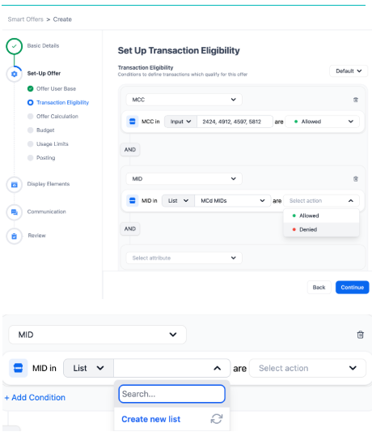

### Condition Configuration

Conditions can be combined using AND and OR logic to create advanced eligibility rules.

* Allowed Conditions
* Denied Conditions
* List Based Filters
* Input Based Filters

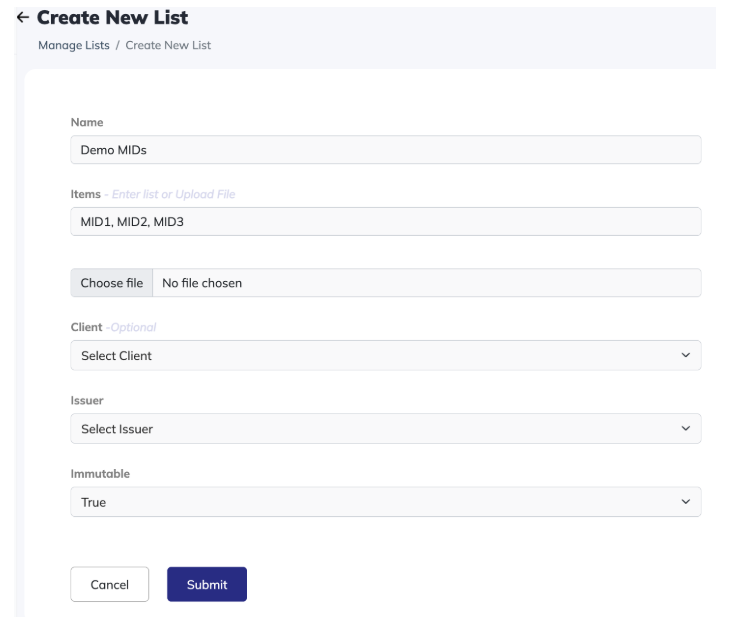

---

## Step 4: Configure Offer Calculation

Define how rewards are calculated.

### Calculation Types

* Fixed Reward
* Percentage Based Reward
* Slab Based Reward

### Additional Controls

* Minimum Reward Cap
* Maximum Reward Cap

Reward calculations are applied to every qualifying transaction.
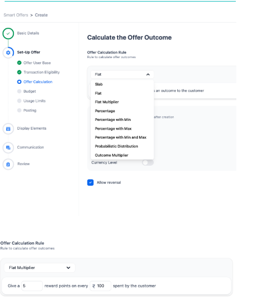

---

## Step 5: Configure Usage Limits

Configure earning restrictions for individual customers.

* Daily Limit
* Weekly Limit
* Monthly Limit
* Lifetime Limit
* Transaction Count Limit

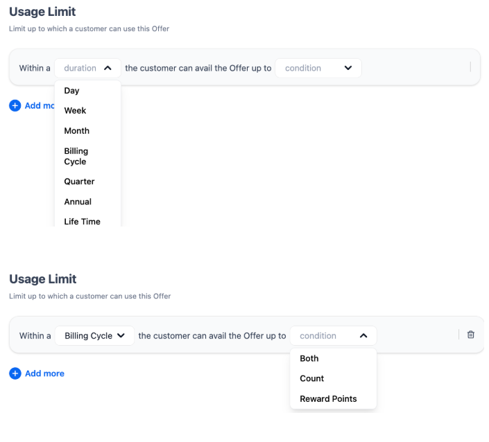

### Usage Limit Examples

Examples help control reward exposure and customer earning frequency.

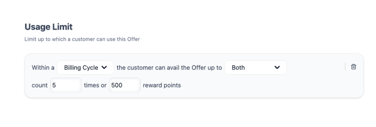

---

## Step 6: Configure Posting

Configure how and when rewards are posted to customers.

### Posting Options

* Enable Posting
* Posting Eligibility
* Immediate Posting
* Scheduled Posting
* Posting Narration
* Reversal Narration

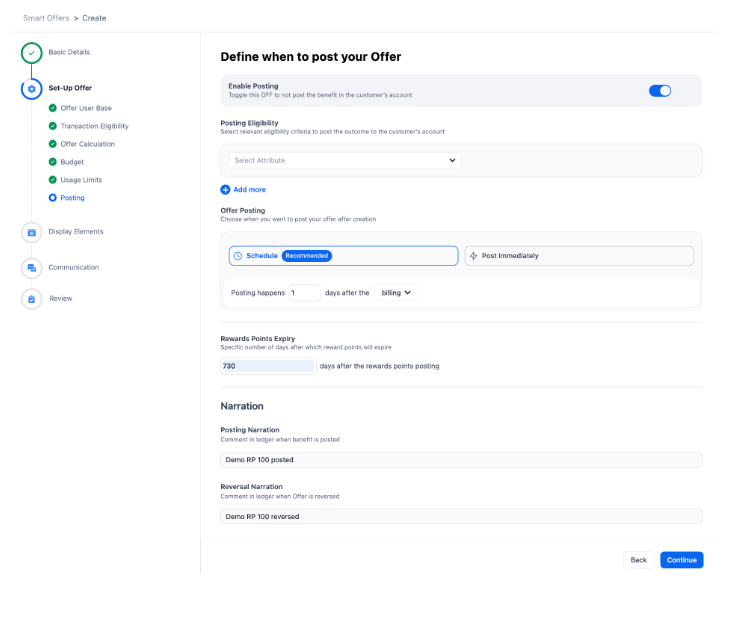

---

## Step 7: Configure Display Elements

Display Elements determine how the offer appears within the customer experience.

### Home Page Configuration

Configure:

* Label
* Banner Title
* Banner Description
* Display Title
* Display Description
* Display Order
* Display Colour
* Merchant Logo
* Background Illustration

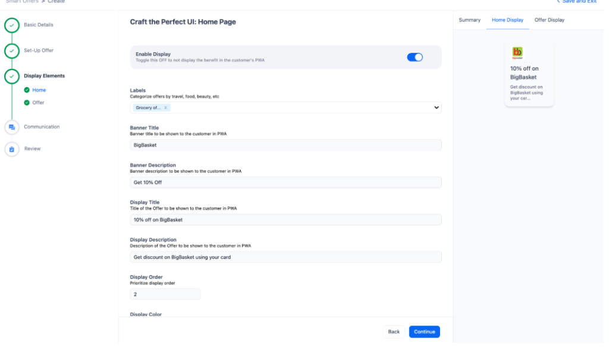

### Offer Details Page

Configure:

* Terms & Conditions
* How To Redeem
* CTA Button Text
* Redirection Link
* Customer Information Sections

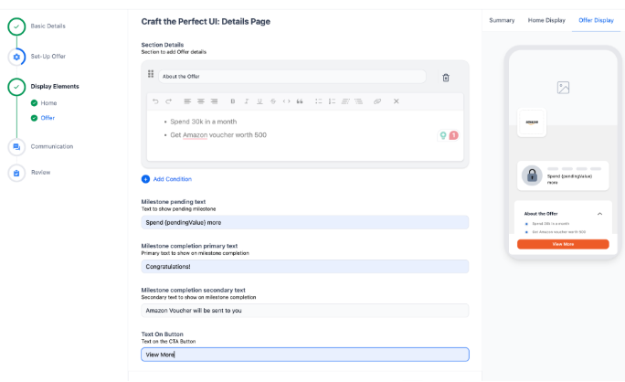

---

## Step 8: Review and Publish

Review all configurations before publishing.

### Review Checklist

* Offer Details
* User Base Configuration
* Transaction Eligibility
* Offer Calculation
* Usage Limits
* Posting Configuration
* Display Elements

Click **Publish** once all configurations have been validated.

The offer status becomes **Scheduled** and automatically changes to **Active** at the configured start time.

---

## Managing Existing Offers

The Offer Listing page allows you to manage existing offers.

Available actions include:

* View
* Edit
* Duplicate
* Delete
* Expire

Available actions vary depending on the current offer status.

### Status Types

* Active
* Scheduled
* Draft
* Expired

### Viewing Offer Details

Click any offer name from the Offer Listing page to view the complete offer configuration, eligibility rules, calculation settings, usage limits, posting setup, and display configuration.

---

## Best Practices

* Verify eligibility conditions before publishing.
* Review reward calculations carefully.
* Configure posting delays to handle reversals and refunds.
* Validate display content before making the offer live.
* Test offer scenarios before activation.

---

## Notes

* Active offers have limited edit capabilities.
* Eligibility and calculation rules become locked once active.
* Scheduled offers can be modified before activation.
* Expired offers can be duplicated to create new campaigns.
* Review all configurations carefully before publishing.
