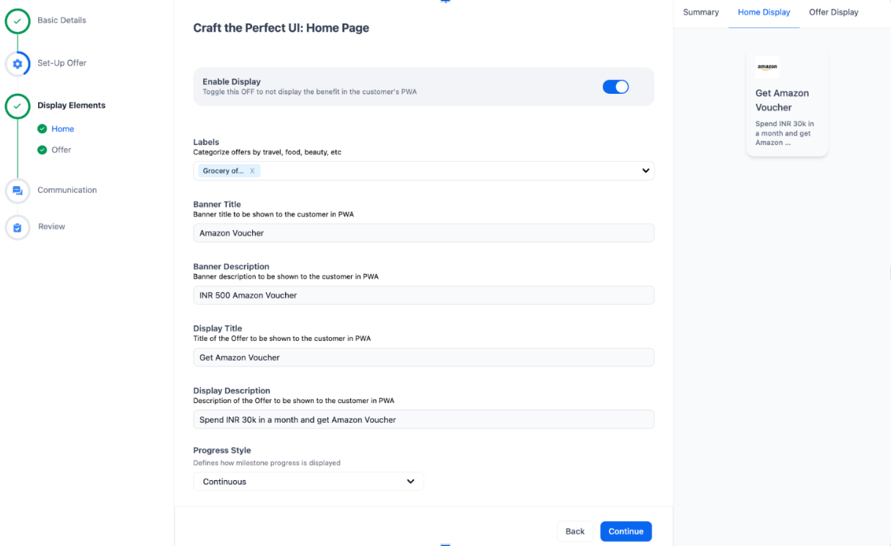
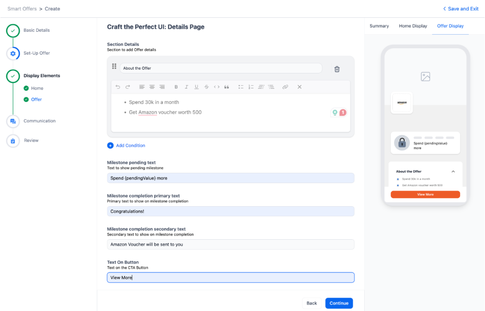

## Introduction

This guide explains how to create and configure Milestone Offers in the Hyperface Dashboard.

Milestone Offers reward customers for reaching a cumulative spending or transaction-count target within a defined time period.

---

## What are Milestone Offers?

A Milestone Offer is a reward type where customers receive rewards after achieving a predefined spending or transaction milestone within a specified period.

Unlike Transactional Offers, milestone eligibility is based on cumulative activity over a subscription cycle. Multiple qualifying transactions can contribute toward milestone completion.

Once all configurations are completed and reviewed, the offer is published and becomes available to eligible customers from the configured start date.
### Key Characteristics

Milestone Offers track customer progress across multiple transactions within a defined subscription cycle.

Key characteristics include:

* Rewards are earned after a milestone threshold is achieved.
* Progress is accumulated across multiple eligible transactions.
* Milestones can be based on total spend or transaction count.
* Subscription cycles determine the duration over which activity is measured.
* Customers may be allowed to repeat milestones across multiple cycles.
* Transaction-level eligibility rules determine which transactions contribute toward milestone progress.

Milestone Offers are commonly used for spend-based campaigns, engagement programs, customer retention initiatives, and recurring reward campaigns.

### Examples

- Spend ₹5,000 within the next 7 days and earn a reward.
- Complete 5 transactions worth more than ₹1,000 each within the next 7 days and receive a reward.

### Components

A Milestone Offer consists of:

- Offer Details
- User Base Configuration
- Milestone Eligibility
- Offer Calculation Rules
- Posting Configuration
- Display Elements

---

## Create a Milestone Offer

1. Log in to Dashboard.
2. Navigate to **Portfolio Growth → Offers → Manage Offers**.
3. Click **Create Offer**.
4. Follow the offer configuration journey.

---

## Step 1: Select Offer Type and Outcome

The first step in the offer creation journey is selecting the offer type and the reward outcome that customers will receive after successfully completing the milestone.

The outcome selected in this step determines the configuration options available later in the Offer Calculation section.

### Configure Offer Type

1. Navigate to the Offer Creation journey.
2. Select **Milestone Offer** as the offer type.
3. Click **Continue** to proceed.

### Configure Outcome Type

Select the reward outcome customers should receive after achieving the milestone.

### Available Outcome Types

#### Cashback

Rewards are credited back to the customer as cashback after milestone completion.

#### Reward Points

Customers receive reward points that can be redeemed according to the program's reward policy.

#### Voucher

Customers receive a voucher or coupon upon successful milestone completion.

#### Smart Tag

Customers receive a Smart Tag that can be used for segmentation, targeting, or future campaign eligibility.

### Important Notes

* The selected outcome type impacts the calculation options available in later steps.
* Different outcome types may require different posting and reward configuration settings.
* Ensure the selected reward outcome aligns with the campaign objective before proceeding.

### Example

If the campaign objective is to reward customers with loyalty points after reaching a spending target, select **Reward Points** as the outcome type.

If the campaign objective is to return a percentage of spend to the customer, select **Cashback** as the outcome type.

Click **Continue** to proceed to Offer Details.

---

## Step 2: Configure Offer Details

### Important Notes

- Offer Name does not need to be unique across offers.
- Offer Description is for internal reference only and is not shown to customers.
- End Date & Time must always be later than Start Date & Time.
- Offers are initially created in Scheduled status.
- Offers automatically become Active when the configured start time is reached.
- Enabling Apply To All Programs disables individual program selection.
- Progress Transfer On Variant Upgrade should only be enabled when milestone progress must continue after a card or account upgrade.

### Offer Information

Configure:

- Offer Name
- Offer Description
- Start Date & Time
- End Date & Time

### Issuer and Program Configuration

Configure:

- Issuer
- Program Type
- Program Selection
- Apply To All Programs
- Progress Transfer On Variant Upgrade
### Why Offer Details Matter

Offer Details define the identity, duration, and scope of the milestone campaign.

Accurate configuration ensures:

- The offer becomes active at the correct time.
- The correct programs are targeted.
- Milestone tracking occurs within the intended duration.
- Operational teams can easily identify and manage the offer.

---

## Step 3: Configure Offer User Base
### Example Scenario

User Base Type = Static Base

Eligibility = All Accounts In Scope

Result:

The offer applies to every eligible account within the selected program scope without additional enrollment requirements.

### Best Practices

* Validate Smart Tag membership before publishing.
* Review inclusion and exclusion criteria carefully.
* Use Dynamic Configuration only when ongoing enrollment is required.
* Test enrollment scenarios before activation.

### User Base Types

#### Static Base

The eligible customer list is fixed when the offer becomes active.

#### Dynamic Configuration

Allows new eligible customers to join throughout the offer lifecycle.

This configuration is commonly used with Opt-In based milestone campaigns.

### Smart Tag Configuration

Smart Tags can be used to include or exclude customer segments.

- Allowed = Only customers in the Smart Tag are eligible.
- Denied = Customers in the Smart Tag are excluded.

Smart Tags must already exist before they can be used in offer configuration.

---

## Step 4: Configure Milestone Eligibility
### Milestone Eligibility Best Practices

The milestone configuration determines how customer progress is tracked and when rewards are triggered.

Before publishing:

* Verify aggregation type selection.
* Validate threshold values.
* Review subscription cycle configuration.
* Confirm transaction eligibility conditions.
* Test milestone completion scenarios.

### Example Transaction Eligibility Rule

Configuration:

* MCC = Grocery
* Transaction Value > ₹1,000
* Status = Allowed

Result:

Only grocery transactions above ₹1,000 contribute toward milestone progress.

### Aggregation Types

#### Sum of Transaction Values

Calculates the total eligible spend accumulated by the customer.

#### Count of Transactions

Calculates the total number of eligible transactions completed by the customer.

### Threshold Configuration

Configure:

- Greater Than
- Greater Than or Equal To
- Less Than
- Equal To

### Subscription Cycle

Available options:

- Custom
- Billing Month

### Transaction Eligibility

Supported filters:

- MCC
- MID
- Merchant Name
- Transaction Value
- Transaction Type
- POS Entry Mode

### Processing Date

Choose:

- Transaction Date
- Posting Date

### Milestone Behaviour

Lock Milestone Progress On Achievement determines whether milestone progress stops accumulating once the threshold is achieved.

- Enabled: Progress is locked once the milestone is completed.
- Disabled: Progress can continue based on cycle rules.

### Subscription Cycle Examples

Example 1:

- Billing Month
- Number of Cycles = 1

The milestone runs for one billing cycle and can be completed once.

Example 2:

- Custom Duration = 7 Days
- Number of Cycles = 4

The milestone resets every 7 days and can be completed up to four times.

---

## Step 5: Configure Offer Calculation
### Calculation Configuration Guidelines

The reward calculation defines the benefit customers receive after completing a milestone.

The selected calculation method should align with campaign objectives, expected customer behaviour, and reward budgets.

### Validation Checklist

Before publishing:

* Verify reward amounts.
* Review multiplier calculations.
* Validate slab ranges.
* Confirm reward caps where applicable.
* Test sample milestone completion scenarios.

### Calculation Rules

Available options include:

- Flat Multiplier
- Fixed Reward
- Percentage Based
- Slab Based

### Additional Options

- Reward Point Capping
- Transaction Level Cap
- MCC Cap
- MID Cap
- Currency Cap
- Program Cap

### Reversal

Enable or disable reward reversals.

### Calculation Examples

#### Fixed Reward

Customers receive a predefined reward after completing the milestone.

Example:

- Complete milestone → Earn 500 reward points.

#### Percentage Based Reward

Rewards are calculated as a percentage of qualifying spend.

Example:

- Spend ₹10,000
- Reward Rate = 5%
- Earn 500 reward points.

#### Slab Based Reward

Different reward values are assigned to different milestone ranges.

Example:

- Spend ₹5,000–₹9,999 → Earn 100 points
- Spend ₹10,000–₹19,999 → Earn 250 points

---

## Step 6: Configure Usage Limits

Optional limits:

- Daily Limit
- Weekly Limit
- Monthly Limit
- Lifetime Limit
- Cycle Count Limit

### Usage Limit Examples

- Daily Limit = 2 rewards per day
- Weekly Limit = 5 rewards per week
- Monthly Limit = 10 rewards per month
- Lifetime Limit = 25 rewards during the offer period

Combined limits can be used to manage reward exposure and campaign costs.
### Usage Limit Best Practices

Usage limits help control campaign costs and prevent excessive reward earning.

Before publishing:

- Review expected reward exposure.
- Configure limits based on campaign objectives.
- Validate cycle count restrictions.
- Ensure limits align with budget allocations.

If no limits are configured, customers may continue earning rewards whenever milestone conditions are satisfied.

---

## Step 7: Configure Posting
### Posting Best Practices

Posting configuration determines when milestone rewards become visible to customers.

Scheduled Posting is generally recommended because it provides sufficient time for transaction reversals, refunds, and settlement validation.

### Operational Recommendations

* Configure posting delays based on reversal windows.
* Use meaningful posting narrations for audit purposes.
* Verify reward expiry settings.
* Review reversal narration before publishing.
* Test reward posting behaviour before activation.

### Posting Options

#### Post Immediately

Rewards are posted immediately after validation.

#### Scheduled Posting

Rewards are posted after a configured delay.

### Configuration

- Enable Posting
- Posting Eligibility
- Days After
- Event
- Reward Point Expiry
- Posting Narration
- Reversal Narration

### Posting Recommendations

Scheduled Posting is recommended because it allows sufficient time for reversals and refunds before rewards are issued.

Immediate Posting should only be used when reversal risk is minimal.

### Additional Configuration

- Posting Eligibility
- Reward Point Expiry
- Posting Narration
- Reversal Narration
---

## Step 8: Configure Display Elements

Display Elements control how the offer is presented to customers across the Hyperface platform.

### Home Page Configuration

Configure:

- Label
- Banner Title
- Banner Description
- Display Title
- Display Description
- Progress Style
- Display Order
- Display Colour
- Merchant Logo
- Background Illustration

### Offer Details Page Configuration

Configure:

- Terms & Conditions
- How To Redeem
- Milestone Pending Text
- Milestone Completion Text
- CTA Button Text
- Redirection Link

---

## Step 9: Review and Publish
### Pre-Publish Validation Checklist

Before publishing a Milestone Offer, verify:

* Offer Details are accurate.
* User Base configuration is correct.
* Milestone Eligibility has been validated.
* Reward calculations have been tested.
* Usage Limits align with campaign objectives.
* Posting Configuration is complete.
* Display content has been reviewed and approved.

Publishing should only be performed after all configurations have been reviewed and validated.

Review all configurations before publishing:

- Offer Details
- User Base
- Milestone Eligibility
- Calculation Rules
- Usage Limits
- Posting Configuration
- Display Elements

Click **Publish**.

The offer status becomes **Scheduled** and automatically changes to **Active** at the configured start time.

---

## Best Practices

- Verify all configurations before publishing.
- Use clear and customer-friendly offer descriptions.
- Review reward calculations before activation.
- Ensure display content aligns with Hyperface branding.
- Validate Terms & Conditions before making the offer live.

---

## Notes

- Active offers have limited edit capabilities.
- Eligibility and calculation rules become locked once the offer is live.
- Review all configurations carefully before publishing.
